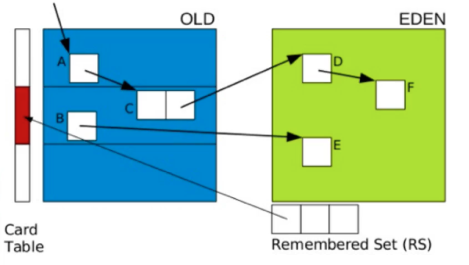

### G1 Garbage First Collector （G1）

* 吞吐量
  * 吞吐量关注的是，在一个指定的时间内，最大化一个应用工作量。
  * 如下方式来衡量一个系统的吞吐量的好坏；
    * 在一个小时内一个事务（或者任务、请求）完成的次数（TPS）
    * 数据库一个小时可以完成多少次查询
  * 关于关注吞吐量的系统，卡顿是可以接受的，因为这个系统关注长时间的大量任务的执行能力，单词快速的响应并不值得考虑。

* 响应能力
  * 响应能力是指一个程序或者系统对请求是否能够及时响应，比如：
    * 一个桌面UI能够多快地响应一个事件
    * 一个网站能够多快返回一个页面请求
    * 数据库能够多快返回查询的数据
  * 对于这类对响应能力灵敏的场景，长时间的的停顿是无法接受的。
  
### G1 Garbage Collector
* G1 收集器是一个面向服务端的垃圾收集器，适用于多核处理器、大内存容量的服务端系统。
* 它满足短时间GC停顿的同时达到一个较高的吞吐量。
* JDK7 以上版本适用。

### G1 收集器的设计目标
* 与应用线程同时工作，几乎不需要 stop the world（与CMS类似）
* 整理剩余空间，不产生内存碎片（CMS只能在Full GC时， 用Stop the World 整理内存碎片）
* GC停顿更加可控
* 不牺牲系统的吞吐量
* GC不要求额外的内存空间（CMS 需要预留空间存储**浮动垃圾**） 
  * 浮动垃圾，并发清理阶段用户线程还在运行，这段时间可能产生新的垃圾，新的垃圾在此次GC无法清除，只能等待下一次GC，这些垃圾称为"浮动垃圾"
* **G1的设计规划是替换掉CMS**
  * G1在某些方面弥补了CMS的一些不足， 比如，CMS使用的是**mark-sweep算法**，自然会产生内存碎片；然而G1基于**copying算法**，高效的整理剩余内存，
  而不是需要管理内存碎片
  * 另外，G1提供了更多的手段，已达到堆GC停顿时间的可控。
  
### Hotspot 虚拟机主要构成

### 传统垃圾收集器堆内存结构

### G1收集器堆结构

* G1 收集器特点
  * Heap 被划分为一个个相等的不连续的内存区域（regions）,每个region 都由一个分代的角色：eden、survivor、old
  
  * 堆每一个角色的数量没有强制的现拟定，也就是说对每一种分代内存的大小，可以动态的变化。
  
  * G1 最大的特点就是高效的执行回收，**优先去执行那些大量独享可回收的区域（region）**
  
  * G1使用了GC停顿可预测的模型，来满足用户设定的GC停顿时间，根据用户设定的目标时间，G1会自动地选择哪些region要清除，
  一次清除多少个region 
  
  * G1从多个region中复制存活的对象，点燃后几种放入了一个region中，同时整理、清除内存（copying 收集算法） 
  
### G1 vs CMS
* 对比使用mark-sweep 的CMS，G1使用的copying 算法不会造成内存碎片
* 对比 Parallel Scavenge (基于 copying)、Parallel Old 收集器（基于 mark-compact-sweep）, Parallel会对
整个区域做整理导致GC停顿会比较长，而G1只是特定地这你一个Region

### G1 重要概念
* 分区（Region）: G1采取了不同的策略来解决并行、串行和CMS收集器的碎片、暂停时间不可控等问题--G1将**整个堆**分成相同大小的分区（Region）

* 每一个分区都可能是年轻代也可能是老年代，但是在同一时刻只能属于某个代。年轻代、幸存区、老年代这些概念还存在，**称为逻辑上的概念**，这样方便复用
之前分代框架的逻辑。

* 在物理上不需要连续，则带来了额外的好处--有的分区内垃圾对象特别多，有的分区内垃圾对象很少，**G1会优先回收垃圾对象特别多的分区**，
这样可以花费较少的时间来回收这些分区的垃圾，则也就是G1名字的来由，即首先手机垃圾最多的分区。

* 依然会在新生代满了的时候，堆整个新生代进行回收--整个新生代中的对象，要么被回收、要么被晋升，至于新生代也采取分区机制的原因，**则是应为这样跟老年代
  的策略统一，方便调整代的大小**
* G1 还是一种带压缩的的收集器，在回收老年代的分区时，时将存活的对象从一个分区拷贝到另一个可用的分区，这个拷贝的过程实现了局部的压缩。

* **收集集合（CSet）**： 一组被回收的分区的集合。在CSet中存活的数据会在GC过程中被一动到另一个可用分区，CSet中的分区可以来自eden空间、survivor空间、
或者老年代

* **已记忆集合（RSet）**：RSet 记录了其他Region中的对象引用本Region中对象的关系，属于points-into结构（谁引用了我的对象）。RSet的价值在于
垃圾收集器不需要扫描整个堆找到谁引用了当前分区中的对象，只需要扫描RSet即可。
  * Region1 和 Region3 中的独享都引用了Region2 中的独享，因此在Region2 和RSet中记录了这个引用
  

* G1 GC是在points-out 和card table 之上再加上一层结构来构成points-into RSet: 每一个Region会记录下到底哪些逼得Region有只想自己的指针
而这些指针分别在哪些card范围内。

* 这个RSet其实是一个**hash table**, key是别的region的起始地址，value是一个集合，里面的元素是card table 的index. 举例来说，
如果Region A 的 RSet里有一项key是region B, value里有index为1234的card, 它的意思就是Region B的一个card 里有引用只想Region A。所以
对 Region A来说，该RSet记录的是points-info 的关系；而card table任然记录了points-out的关系

* Snapshot-At-The-Beginning (SATB) SATB 是G1 GC在并发标记阶段使用的增量式的标记算法。

* 并发标记是并发多线程的，但是并发线程在同一个时刻只能扫描一个分区 

### G1相对CMS的优势
* G1在压缩空间方面是有优势的
* G1通过将内存空间分成区域（Region）的方式变内存碎片的问题
* Eden、Survivor、 Old区不在固定，在内存使用效率上来说是更加灵活
* G1 可以通过设置预期停顿时间（Pause Time）来控制收集时间，避免应用雪崩现象。
* G1 在回收内存后回马上同时合并空间内存的工作，而CMS默认是在STW（stop the world）的时候
* G1 会在Young GC中使用，而CMS只能在Old区使用

### G1 的适合场景
* 服务端多核CPU、JVM内存占用较大的应用
* 应用在运行过程汇总会产生大量内存碎片、需要经常压缩空间
* 想要更可控、可预期的GC停顿周期；预防高并发应用下的雪崩现象

### G1 GC的模式
* G1提供了两种GC模式: Young GC和Mixed GC, 两种都是完全Stop The World的

* Young GC: 选定所有年轻代里的Region。通过控制年轻代的Region个数，即年轻代内存大小，来控制Young GC的时间开销。

* Mixed GC: 选定所有年轻代里的Region。外加根据global concurrent marking统计得出收集收益高的若干老年代Region。在用户指定的
开销目标范围内尽可能选择收益高的老年代Region。 （**包含了Young GC**）

* Mixed GC: 不是Full GC, **它只能回收部分老年代Region**， 如果Mixed GC实现在无法跟上程序程序分配内存速度，导致老年代填满无法继续进行Mixed GC,
就会使用Serial Old GC(Full GC) 来收集整个GC heap **所以本质上， G1是不提供Full GC的**。

### global concurrent marking
* global concurrent marking 的执行过程类似于 CMS，但是不同的是，在G1 GC中它**主要是为Mixed GC提供标记服务**，并不是一次GC过程的一个必须环节。
* global concurrent marking 的执行过程分为四个步骤：
  * **初始标记（initial mark, STW）**: 它标记了从GC Root开始直接可达的对象
  * **并发标记（Concurrent Marking）**: 这个阶段从GC Root开始对heap 中的对象进行标记，标记线程与应用程序线程并发执行，并且收集各个Region存活对象
  信息。
  * **重新标记（Remark, STW）**: 标记哪些在并发标记阶段发生变化的对象，将被回收。
  * **清理（Cleanup）**: 清理空Region（没有存活对象的），加入到free list.
  
  * 第一个阶段 initial mark 是共用了Young GC 的暂停，这是因为他们可以服用root scan操作，所以可以说 global concurrent marking 是伴随
  Young GC而发生的。
  * 第四阶段 Cleanup 只是回收了没有粗活对象的Region，所以它并不需要STW

### G1在运行过程中的主要模式
* YGC（不同于 CMS）
  * 触发的时机，是新生代满了的时候会触发 Young GC，一次STW。 对象进入Survivor有的也会直接进入Old中

* 并发阶段
  * 全局并发标记阶段。根本的目的，为了接下来的混合回收标记，提供最高价值回收的标记

* 混合模式
  * 1.执行一次YGC ,2.对第二次标记出来的回收效率最高的进行回收。

* Full GC （一般是G1出现问题时发生）
  * Full GC 不属于G1, G1的目的是为了减少Full GC（出现的场景: 1.对象创建速度大于对象回收速度，2.回收的事件比较短，那么回收过于频繁，进行回退成Full GC
  （Serial Old GC）

* G1 YGC 在Eden充满时触发，在回收之后所有属于Eden的区块全部变成了空白及不属于任何一个分区（Eden、Survivor、Old）

### Mixed GC 
* 什么时候触发Mixed GC?
* **G1HeapWastPercent** : 在global concurrent marking结束后，我们可以知道old gen regions 中有多个空间要被回收，在每次Young GC之后再次发生
Mixed GC之前，会检查垃圾占比是否到达此参数，只有达到了，下次才会发生 Mixed GC
* **G1MixedGCLiveThresholdPercent**: old generation region 中存活对象的占比，只有在此参数之下，才会被选入 CSet
* **G1MixedGCCountTarget**: 一次global concurrent marking 之后，最多执行Mixed GC的次数。
* **G1OldCSetRegionThresholdPercent**: 一次Mixed GC 中能够选入 CSet 的最多old generation region 数量
* 其他参数：
  * -XX:G1HeapRegionSize, 设置Region大小，非最终值
  * -XX:MaxGCPauseMillis, 设置G1收集过程目标时间，默认200ms，不是硬性条件
  * -XX:G1NewSizePercent, 新生代最小值，默认5%
  * -XX:G1MaxNewSizePercent, 新生代最大值，默认60%
  * -XX:ParallelGCThreads, STW期间，并行GC线程数
  * -XX:ConcGCThread, 并发标记阶段，并行执行的线程数
  * -XX:InitiatingHeapOccupancyPercent: 设置触发标记周期的 Java堆占用率阈值。默认值是45%。这里的Java堆占是指的是non_young_capacity_bytes
  包括old + humongous
  
### G1收集概览
* G1算法将划分为若干个区域（Region），它仍然属于分代收集器。不过，这些区域的一部分包含新生代，**新生代的垃圾收集器仍然采用暂停所有应用线程的方式，
将存活独享拷贝到老年代或者Survivor空间**。老年代也分成了很多区域（Region），**G1收集器通过将对象一个区域复制到另外一个区域，完成了清理工作**。这就意味着，在
正常的处理过程中，G1完成了堆的压缩（至少是部分堆的压缩），**这样也就不会有CMS内存碎片的问题的存在了**

* Humongous 区域 (本质就是大对象)
  * 在G1中，有一种特殊的区域，叫**Humongous区域**。如果一个对象占据的空间达到或者是超过了分区容量50%以上，G1收集器就认为这是一个巨型对象。这些
  巨型对象，**默认直接会被分配在老年代**，但是如果它是一个短期存在的巨型对象，就会对垃圾收集器造成负面影响。为了解决这个问题，G1划分了一个Humongous区
  ，它用来专门存放巨型对象。如果一个H区装不下一个巨型对象，那么G1会寻找连续的H分区来存储。**为了能找到连续的H区，有时候不得不启动Full GC**。
  
* G1 Young GC
  * Young GC主要是对Eden区进行GC， **它在Eden空间耗尽时会触发**。在这种情况下, Eden空间的数据会一动到Survivor空间中，如果Survivor空间不够，
  Eden空间中的部分数据会直接晋升到老年代空间。 **Survivor区的数据一动到行的Survivor区中，也有部分数据晋升到老年代空间中**。**最终Eden空间的数据
  会清空**，GC完成工作，应该线程继续执行
  
  * 如果仅仅GC新生代度下个，我们如何找到所有的根对象呢？老年代所有对象都是根对象么？那这样扫描下来就会耗费大量的时间。于是，G1引进了RSet的概念。它的
  全称是Remembered Set, 作用是跟踪只想某个 heap区的对象引用。
  
  
  * 在CMS中，也有RSet的概念，在老年代中有一块区域用来记录指向新生代的引用。这是一种point-out,在进行Young GC时，扫描根时，仅仅需要扫描这一块区域，
  而不需要扫描整个老年代
  
  * 但是在G1中，并没有point-out，这是由于一个分区太小，分区数量太多，如果是使用point-out的话，会造成大量的扫描浪费，有些根本不需要GC的分区引用
  也扫描了。
  
  * 于是G1中使用point-in来解决。**point-in的意思是哪些分区引用了当前分区中的对象**。这样，仅仅将这些对象当做根来扫描就避免了无效的扫描。
  
  * 由于新生代有多个，那么我们需要在新生代之间记录引用吗?这个是不必要的。原因在于每次GC时，所有新生代都会被扫描。**所以只需要记录老年代到新生代之间的
  引用即可**
  
  * 需要注意的是，如果引用的对象很多，赋值器需要每个引用做处理，赋值器开销会很大，为了解决赋值器开销这个问题。在G1中又引入了另外一个概念，卡表（Card Table）
  一个Card Table 将一个分区在逻辑上划分为固定大小的连续区域，每个区域称为卡，通常卡较小，结余128-512字节之间。Card Table通常为字节数组，由Card的
  索引（即数组下标）来标识每个分区的空间地址。
  
  * 默认情况下，每个卡都未被引用。当一个地址空间被引用时，这个地址空间对应的数组索引的值被标记为'0'，即标记为脏被引用，此外RSet也将这个数组下标
  记录下来。一般情况下， 这个RSet其实是一个Hash Table, Key是别的Region的起始地址，Value是一个集合，里面的元素是Card Table的Index
  
  * Young GC 的5个阶段
    * 阶段1：根扫描
      * 静态和本地对象被扫描
    * 阶段2：更新RS
      * 处理dirty card队列更新RS
    * 阶段3：处理RS
      * 检测从年轻代只想老年代的对象
    * 阶段4：对象拷贝
      * 拷贝存活的对象到survivor/old区域
    * 阶段5：处理引用队列
      * 软引用，弱引用，虚引用处理

### 再谈Mixed GC
* Mixed GC 不仅惊醒正常的新生代垃圾收集，同时也回收部分后台扫描线程标记的老年代分区
* 它的GC步骤分为两步：
  * 全局并发标记（global concurrent marking）
  * 拷贝存活对象（evacuation）
* 在G1 GC中, global concurrent marking 主要是为了Mixed GC提供标记服务的，并不是一次GC过程的一个必须环节global concurrent marking的
执行过程分为四个步骤：
  * 初始标记（initial mark, STW）：它标记了从GC Root开始直接可达的对象。
  * 并发标记（Concurrent Marking）：这个阶段从GC Root开始对heap 中的对象进行标记，标记线程与应用程序线程并发执行，并且各个Region的存活对象信息
  * 重新标记（Remark, STW）：标记哪些在并发标记阶段发生变化的对象，将被回收。
  * 清理（Cleanup）：清除空Region（没有存活对象的），加入到free list.

### 三色标标记算法
* 提到并发标记，我们不得不了解并发标记的三色标记算法。它是描述追踪式回收器的一种有效的方法，利用它可以推演回收器的正确性
* 我们将对象分为三种类型：
  * 黑色：根对象，或者该对象与它的子对象都被扫描过（对象被标记了，且它的所有field也被标记完了）
  * 灰色：对象本身被扫描，还没有扫描完该对象中的子对象（它的field还没有被标记或标记完）
  * 白色：未被扫描对象，扫描完成所有对象之后，最终为白色的为不可达对象，即垃圾对象（对象没有被标记到）

* 三色标记过程
  * 第一步，三色标记算法，如果将根对象设置为黑色，那么下级节点的为灰色，再下面的的为白色
  * 第二步，灰色扫描完毕后，那么剩下的白色变为灰色
  * 第三步，灰色扫描完毕后，那么全部被标记为黑色，不可达的还是为白色

* 三色标记算法的对象丢失
  * 但是如果在标记过程中，应用程序也进行，那么对象的指针就有可能改变。这样的话，我们就会遇到一个问题：**对象丢失**。  
  * 例子：
    * 第一步，初始
      Root（黑）-> A（黑）
      Root（黑）-> B（灰）-> C（白）
    * 第二步，在当前场景下执行如下操作
      * A.c = C 
      * B.c = null
      
      Root（黑）-> A（黑）-> C（白）
      Root（黑）-> B（黑）
    * 第三步，如果内存回收的时候，就会将C回收掉，会导致C对象丢失。

### SATB
* 在G1中，使用的是SATB（Snapshot-At-The-Beginning）的方式，删除的时候记录所有的对象
  * 并发标记过程中处理对象引用变更
  * 并发标记的时候也会新创建处理的问题
* 它的三个步骤
  * 在开始标记的时候生成一个快照图，标记存活对象
  * 在并发标记的时候所有被改变的对象入队（**在write barrier 里把所有旧的引用指向的对象都编程非白的**）改变对象变为灰色
  * 可能存在浮动垃圾，将在下次被收集
  
### G1 混合式回收
* G1到现在可以知道哪些老的分区可回收垃圾最多，当全局鬓发标记完成后在某个时刻，就开始Mixed GC。这些垃圾回收被称为"混合式"是因为他们不仅仅进行正常的
新生代垃圾收集，同时也回收部分后台扫描线程标记的分区
* 混合式GC也是采用的复制**清理策略**，当GC完成后，会重新释放空间

### G1 分代算法
* 为老年代设置分区的目的是老年代里有的分区垃圾比较多，有的分区垃圾比较少，这样在回收的时候可以专注于收集垃圾多的分区，这也是G1名称的来由。
* 不过这个算法并不适合新生代垃圾收集，因为新生代的垃圾收集算法是复制算法，但是**新生代也使用了分区机制主要是因为便于代大小调整**

### SATB 详解
* SATB是维持并发GC的一种手段。G1并发的基础就是SATB。SATB可以理解成在GC开始之前对堆内存里的对象做一次快照，此时活的对象就认为是活的，从而形成一个对象图

* 在GC收集的时候，新生代的对象也认为是活的对象，除此之外其他不可达的对象也认为是垃圾对象。

* 如何找到在GC过程分配的对象呢？每个region记录着两个**top-at-mark-start(TAMS)** 指针，分别为prevTAMS 和nextTAMS。在TAMS以上的独享就是新分配
的，因而被视为**隐式marked**

* 通过这种方式我们就找到了再GC过程中新分配的对象，并把这些对象认为是活的对象。

* 解决了对象在GC过程中分配的问题，呢么GC过程中引用繁盛变化的问题是怎么解决的呢？

* G1给出的解决办法是通过**Write Barrier. Write Barrier 就是堆引用字段进行赋值做了额外处理**。通过Write Barrier就可以了解到哪些引用对象发生了
什么样的变化

* mark 的过程就是遍历heap标记live object的过程，采用的三色标记算法，这三种颜色为white（表示还未访问到）、gray（访问到但是它用到的引用还诶有完全扫描）
、black (访问到而且其用到的引用完全扫描完)

* 整个三色标记算法就是从**GC Roots出发**遍历heap，针对可达独享先标记white为gray， 然后再标记gray为black; 遍历完成之后所有可达对象都是black的，所有
white 都是可以回收的。

* SATB仅仅对于在marking开始阶段进行"snapshot"（marked all reachable at mark start), 但是concurrent 的时候并发修改可能造成对象漏标记

* 漏标的场景
  * 对black 新引用了一个white对象，然后从gray对象中删除了对该white 对象的引用，这样会造成该white 对象漏标记。
  * 对black 新引用了一个white对象，然后从gray对象删除了一个引用该white对象的white对象，这样也会造成该white对象漏标记。
  * 对black 新引用了一个刚new出来的一个white对象，没有其他的gray对象引用该white对象，这样也会造成该white对象漏标记。
  
* 对于三色算法在concurrent的时候可能产生漏标的问题，SATB在marking阶段中，对于从gray对象移除的目标引用对象标记为gray, **对于从gray对象移除的
目标引用对象标记为gray,对于black引用的新产生的对象标记为black;** 由于是在开始的时候进行snapshot, 因而可能存在Floating Garbage

* 漏标和误标
  * 误标识没有关系，顶多造成浮动垃圾，在下次GC还是可以回收的，但是漏标的后果是致命的把本应该存活的对象给回收了，从而影响程序的正确性。
  * 漏标的情况只会发生在白色对象中，且满足一下任意一个条件
    * 并发标记时，应用线程给一个黑色独享的引用类型字段赋值了该白色对象
    * 并发标记时，应用线程删除所有灰色对象到该白色对象的引用
  * 第一种情况，利用post-write barrier 记录所有新增的引用关系，然后根据这些引用关系为根重新扫描一遍
  * 对于第二种情况，利用pre-write barrier, 将所有即将被删除的引用关系的旧引用记录下来，最后这些旧引用为根重新扫描一遍

### 停顿预测模型
* G1收集器突出表现出来的一点就是通过一个停顿预测模型根据用户配置的停顿时间来选择CSet的大小，从而达到用户期待的应用程序停顿时间。
* 通过-XX:MaxGCPauseMillis参数来设置。这一点有些类似Parallel Scavenge收集器。关于停顿时间的设置并不是越短越好。
* 设置的时间越短意味着每次收集的CSet越小，导致垃圾逐步累积变多，**最终不得不退化成 Serial GC; 停顿时间设置得过长，那么会导致每次都会产生长时间
的停顿，影响了程序对外的响应时间。

### G1 的收集模式
* Young GC: 收集年轻代里的Region
* Mixed GC: 年轻代的所有Region + 全局并发标记阶段选出的收益高的Region
* 无论是Young GC还是Mixed GC都只是并发拷贝的阶段
* 分代G1 模式选择CSet有两种子模式，分别对应 Young GC 和MixedGC;
* Young GC: CSet 是**所有年轻代里面的Region**
* Mixed GC: CSet 是**所有年轻代里的Region**加上在全局并发标记阶段标记出来的收益高的Region
* G1 的运行过程是这样的：会在Young GC 和Mixed GC之间不断地切换运行，同时定期地做全局并发标记，在实在赶不上对象创建速度的情况下使用 Full GC(Serial GC)
* 初始标记是在Young GC上执行的，在进行全局并发标记的时候不会做Mixed GC,再做 Mixed GC的时候也不会启动初始标记阶段。
* 当Mixed GC赶不上对象产生的速度的时候就退化成Full GC, 这一点是需要重点调优的地方。

### G1的最佳实践
* 不断调优暂停时间指标
  * 通过-XX:MaxGCPauseMillis=x 可以设置启动应用程序暂停时间，G1在运行的时候会根据这个参数选择CSet来满足响应时间的设置，一般情况下这个值设置到
   100ms或者200ms都是可以的（不同情况下会不一样），如果设置成50ms就不太合理。**暂停时间设置太短，就会导致出现G1跟不上垃圾产生的速度。最终退化为Full GC**
   所以对这个参数的调优是一个持续的过程，逐步调整到最佳状态。
* 不要设置新生代和老年代的大小
  * G1收集器在与运行的时候会调整新生代的大小。通过改变代的大小来调整对象晋升的速度以及晋升年龄，从而达到我们为收集器设置的暂停时间目标
  * 设置了新生代大小相当于放弃了G1为我们做了自动调优。我们需要做的只是**设置整个堆内存**的大小，剩下的交给G1自己去分配各个代的大小即可。
* 关注Evacuation Failure
  * Evacuation Failure类似于CMS里面的晋升失败，堆空间的垃圾太多导致无法完成Region之间的拷贝，于是不得不退化成Full GC来做一个全局范围内的垃圾收集。
  
  
### 官方文档
  
* 地址: https://www.oracle.com/webfolder/technetwork/tutorials/obe/java/G1GettingStarted/index.html
 